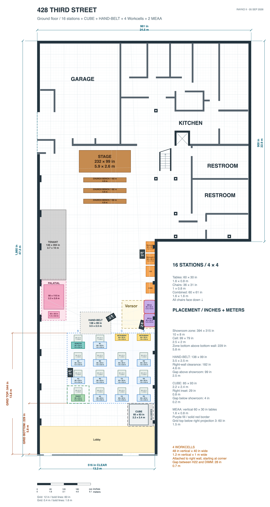

# R2S2R physical floor plan

[Review PDF](output/pdf/floorplan-review.pdf) · [View full-resolution floor plan](floorplan.png) · [Download editable drawing](floorplan.drawio) · [Blank floor plan](floorplan-blank.png)



## Files

- `floorplan.drawio` — editable source, with the full layout and blank floor plan on separate pages.
- `floorplan.png` — current full layout, viewable without draw.io.
- `floorplan-blank.png` — blank floor-plan preview.
- `references/` — reference images used for the station layout.

Dimensions are labeled in inches with meters below. Display values are rounded upward to at most one decimal place; the editable geometry retains its precision.

## Update the drawing

1. Open `floorplan.drawio` in draw.io Desktop or [diagrams.net](https://app.diagrams.net/).
2. Edit and save the drawing.
3. Regenerate both PNG previews with `./scripts/export-pngs.sh`.
4. Commit the drawing and PNGs together on a branch, then open a pull request.

The export script uses draw.io Desktop on macOS. On another platform, set `DRAWIO_BIN` to the draw.io executable path.

```bash
./scripts/export-pngs.sh
git switch -c update-floor-layout
git add floorplan.drawio floorplan.png floorplan-blank.png
git commit -m "Update floor layout"
git push -u origin update-floor-layout
```

Git history records each saved version. Use GitHub's **History** view to review revisions, or download a previous version from a commit.

## Propose an edit

Anyone can propose changes through a pull request:

1. Fork this repository into your GitHub account.
2. Create a branch in your fork and edit `floorplan.drawio` using draw.io Desktop or diagrams.net.
3. Regenerate both PNGs with `./scripts/export-pngs.sh` and commit the drawing and PNGs together.
4. Open a pull request from your fork to this repository's `main` branch.

The `main` branch requires a pull request, without an approving review. Direct pushes, force pushes, and branch deletion are blocked, including for repository administrators. Review conversations must be resolved before merging.
